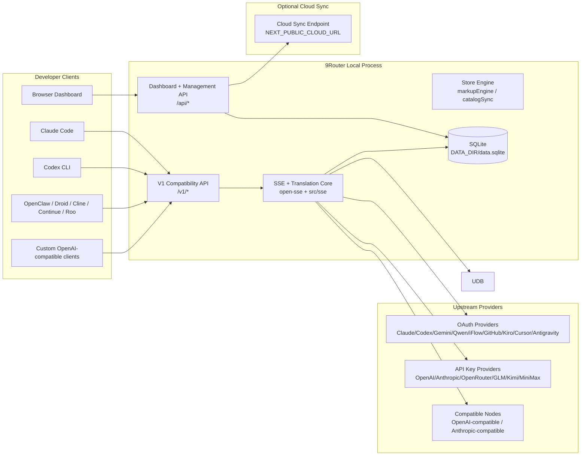
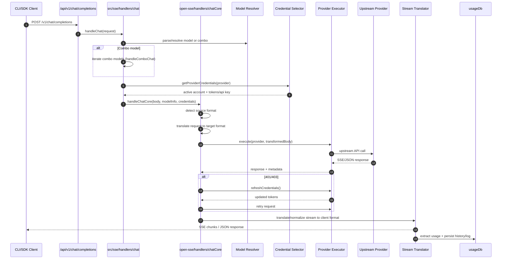
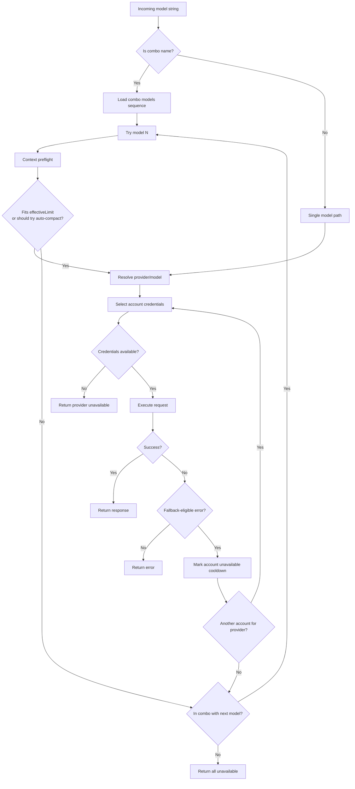
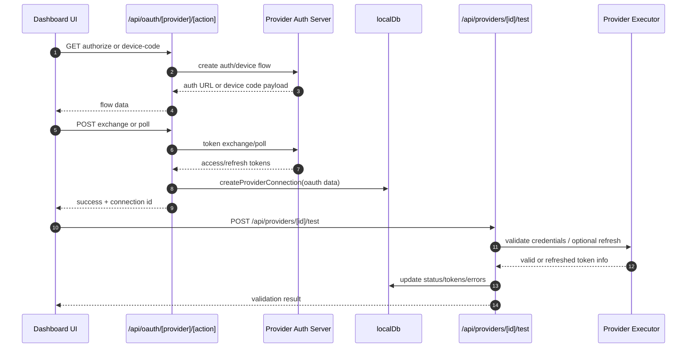
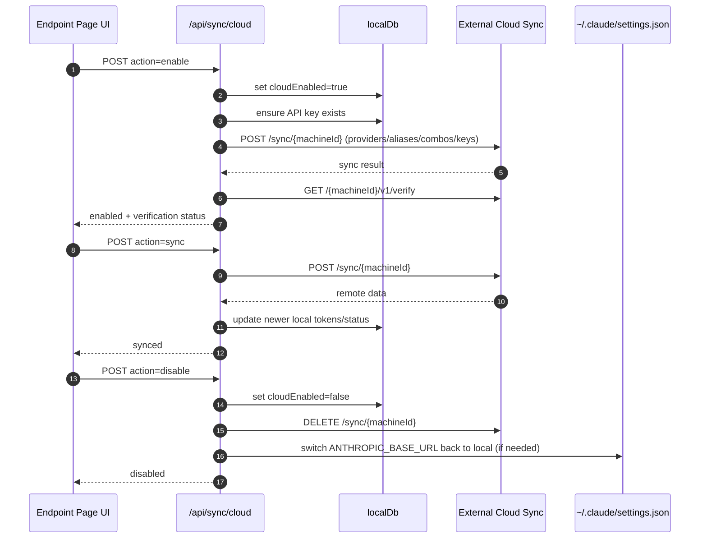
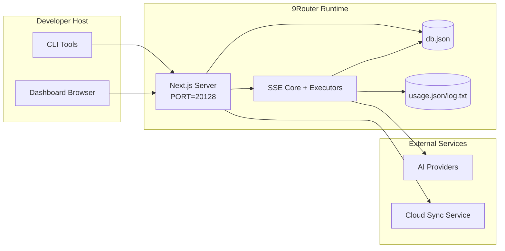

# Kiến trúc 9Router

_Cập nhật lần cuối: 2026-08-18_

## Tóm tắt điều hành (Executive Summary)

9Router là một cổng định tuyến AI cục bộ (local AI routing gateway) và dashboard được xây dựng trên Next.js.
Hệ thống cung cấp một endpoint tương thích OpenAI (OpenAI-compatible endpoint) duy nhất (`/v1/*`) và định tuyến traffic qua nhiều upstream provider với khả năng dịch định dạng (translation), fallback, làm mới token (token refresh), và theo dõi usage.

Năng lực cốt lõi:

- Bề mặt API tương thích OpenAI cho CLI/tools
- Dịch request/response giữa các định dạng provider
- Fallback theo combo model (chuỗi nhiều model)
- Fallback cấp account (nhiều account cho mỗi provider)
- Quản lý kết nối provider bằng OAuth và API key
- Lưu trữ SQLite cho providers, keys, aliases, combos, settings, pricing, products
- Theo dõi usage/cost và ghi log request
- Telegram Store với product catalog, markup rules, order/inventory, fulfillment
- Cloud sync tùy chọn cho đồng bộ đa thiết bị/trạng thái

Mô hình runtime chính:

- Next.js app routes dưới `src/app/api/*` triển khai cả dashboard APIs và compatibility APIs
- SSE/routing core dùng chung trong `src/sse/*` + `open-sse/*` xử lý provider execution, translation, streaming, fallback, và usage

## Phạm vi và ranh giới (Scope and Boundaries)

### Trong phạm vi (In Scope)

- Local gateway runtime
- Dashboard management APIs
- Provider authentication và token refresh
- Request translation và SSE streaming
- Local state + usage persistence
- Điều phối cloud sync tùy chọn

### Ngoài phạm vi (Out of Scope)

- Triển khai cloud service phía sau `NEXT_PUBLIC_CLOUD_URL`
- Provider SLA/control plane bên ngoài local process
- Bản thân các external CLI binaries như Claude CLI, Codex CLI, v.v.

## Bối cảnh hệ thống cấp cao (High-Level System Context)



## Thành phần runtime cốt lõi (Core Runtime Components)

## 1) Lớp API và định tuyến (API and Routing Layer - Next.js App Routes)

Thư mục chính:

- `src/app/api/v1/*` và `src/app/api/v1beta/*` cho compatibility APIs
- `src/app/api/*` cho management/configuration APIs
- Next rewrites trong `next.config.mjs` map `/v1/*` sang `/api/v1/*`

Các compatibility routes quan trọng:

- `src/app/api/v1/chat/completions/route.js`
- `src/app/api/v1/messages/route.js`
- `src/app/api/v1/responses/route.js`
- `src/app/api/v1/models/route.js`
- `src/app/api/v1/messages/count_tokens/route.js`
- `src/app/api/v1beta/models/route.js`
- `src/app/api/v1beta/models/[...path]/route.js`

Các domain quản lý:

- Auth/settings: `src/app/api/auth/*`, `src/app/api/settings/*`
- Providers/connections: `src/app/api/providers*`
- Provider nodes: `src/app/api/provider-nodes*`
- OAuth: `src/app/api/oauth/*`
- Keys/aliases/combos/pricing: `src/app/api/keys*`, `src/app/api/models/alias`, `src/app/api/combos*`, `src/app/api/pricing`
- Usage: `src/app/api/usage/*`
- Sync/cloud: `src/app/api/sync/*`, `src/app/api/cloud/*`
- CLI tooling helpers: `src/app/api/cli-tools/*`

## 2) SSE + Translation Core

Các module luồng chính:

- Entry: `src/sse/handlers/chat.js`
- Điều phối core: `open-sse/handlers/chatCore.js`
- Provider execution adapters: `open-sse/executors/*`
- Format detection/provider config: `open-sse/services/provider.js`
- Model parse/resolve: `src/sse/services/model.js`, `open-sse/services/model.js`
- Combo fallback logic: `open-sse/services/combo.js`
- Account fallback logic: `open-sse/services/accountFallback.js`
- Provider input-limit (per-model) / Kiro auto-compact helper: `open-sse/utils/autoCompact.js` (`getProviderAutoCompactLimit(provider, model)`); per-model `contextWindow` source: `open-sse/config/providerModels.js`
- Translation registry: `open-sse/translator/index.js`
- Stream transformations: `open-sse/utils/stream.js`, `open-sse/utils/streamHandler.js`
- Pre-content empty/error peek (relay): `open-sse/utils/ssePeek.js` (`peekStreamForEmptyUpstream`); in-place retry tại `open-sse/executors/default.js`
- Buffered combo fallback (opt-in): `open-sse/utils/bufferFallback.js`
- Usage extraction/normalization: `open-sse/utils/usageTracking.js`

## 3) Lớp lưu trữ (Persistence Layer — SQLite)

Primary database: SQLite via better-sqlite3 (sync driver, single-writer).

- **Driver:** `src/lib/db/driver.js` — singleton adapter, `getAdapter()` trả về `better-sqlite3` instance
- **Data file:** `${DATA_DIR}/data.sqlite`
- **Migration + auto-sync:** `src/lib/db/migrate.js`

### Schema lifecycle (`syncSchemaFromTables`)

Không dùng migration framework truyền thống. Schema được khai báo tập trung trong `src/lib/db/schema.js` dưới dạng object `TABLES`:

```js
export const TABLES = {
  settings: {
    columns: { id: "INTEGER PRIMARY KEY", data: "TEXT NOT NULL" },
    indexes: [],
  },
  // ...
};
```

Hai cơ chế chạy tuần tự tại boot:

1. **Versioned migrations** (`runVersionedMigrations`): chạy các file trong `src/lib/db/migrations/*.js` theo số version. Mỗi migration có `version` + `name` + `up(adapter)`. Trạng thái lưu trong `_meta.schemaVersion`.

2. **Auto-sync** (`syncSchemaFromTables`): dựng `buildCreateTableSql` từ `TABLES`, chạy `PRAGMA table_info` diff columns, thêm column thiếu bằng `ALTER TABLE ADD COLUMN`. Indexes được chạy idempotent mỗi boot.

**Cold-start optimization**: fingerprint djb2 của `TABLES` declaration được stamp vào `_meta.tablesFingerprint`. Nếu fingerprint không đổi ở lần boot sau, auto-sync skip column-diff loop (chỉ chạy index CREATE). Xóa được ~5–10s cold start trên production.

### Repository pattern

Truy vấn DB được đóng gói trong `src/lib/db/repos/*Repo.js`:

- `markupRulesRepo.js` — CRUD markup rules
- `productsRepo.js` — product + external product queries
- Các repo khác (orders, inventory, entitlements) từ Epic I

Export tập trung qua `src/lib/db/index.js`.

### Legacy JSON import

Một lần duy nhất khi DB fresh, `src/lib/db/migrate.js` import legacy data từ `db.json` (file cũ) vào SQLite tables. Đánh dấu bằng marker file `.migrated-from-json`.

## 4) Frontend State Management (Zustand Stores)

Dashboard UI dùng Zustand stores (`src/store/*`) để quản lý client-side state với caching + TTL pattern:

```text
store                    TTL     nguồn                          ghi chú
authStore                60s     GET /api/auth/status           cache + dedupFetch, invalidate() khi logout
settingsStore            60s     GET /api/settings               read-only cache
```

### AuthStore pattern

- `fetchAuthStatus()` dùng `dedupFetch` với `cache: "no-store"` (tránh Next.js HTTP cache phá TTL)
- Zustand selector pattern: component gọi `useAuthStore(s => s.role)` — không cần `.then()`, store tự hydrate
- `invalidate()` clear cached data + timestamp → lần đọc sau fetch lại

### Request dedup (`src/shared/utils/requestDedup.js`)

- Utility `dedupFetch(url, options)` — in-flight request deduplication
- Key = `method:url:body` — concurrent identical GET requests share 1 network call
- Callers clone response (`r.clone()`) — mỗi caller nhận response riêng
- **GET-only safety**: POST/PUT mutations không nên dedup (different semantics, body key chỉ để tránh collision)

## 5) Auth + Security Surfaces

- Dashboard cookie auth: `src/proxy.js`, `src/app/api/auth/login/route.js`
- API key generation/verification: `src/shared/utils/apiKey.js`
- Provider secrets được lưu trong các entry `providerConnections`
- Hỗ trợ proxy tùy chọn cho upstream calls qua env proxy variables (`open-sse/utils/proxyFetch.js`)

## 6) Cloud Sync

- Scheduler init: `src/lib/initCloudSync.js`, `src/shared/services/initializeCloudSync.js`
- Periodic task: `src/shared/services/cloudSyncScheduler.js`
- Control route: `src/app/api/sync/cloud/route.js`

## 7) Store System (Product Catalog & Markup)

Store module xử lý product catalog sync từ external source, markup rules, và publishing.

### Catalog sync (`src/lib/store/catalogSync.js`)

- Poll external store API, sync sản phẩm vào `externalProducts` table
- Import webhook event-based sync (real-time update từ external store)
- Mapping: external fields → internal `products` table fields
- **QĐ6 guard**: sync NEVER overwrites `isActive`/`isPublished` (admin decisions được tôn trọng)

### Markup engine (`src/lib/store/markupEngine.js`)

Áp dụng markup rules lên `supplierPrice` từ external sync để tính `priceCredits`:

```
supplierPrice → [markup rules] → priceCredits
```

Rule types:

| Kind | Hành vi |
|------|---------|
| `fixed` | Cộng/trừ số tiền cố định: `priceCredits = supplierPrice + amount` |
| `percentage` | Phần trăm: `priceCredits = supplierPrice * (1 + pct / 100)` |
| `formula` | Expression-based (reserved cho tương lai) |

Implementation:
- `src/lib/db/repos/markupRulesRepo.js` — CRUD + `listActiveRules()` sort by priority
- `src/app/api/store/markup-rules/*` — API routes cho admin CRUD
- `src/app/api/store/products/[id]/publish/route.js` — publish product ra storefront

### Markup rules migration (`011-markup-rules`)

Seed mặc định: một rule percentage `50%` — supplierPrice + 50% = priceCredits. Idempotent (`ON CONFLICT(name) DO NOTHING`).

## Vòng đời request (`/v1/chat/completions`)



## Luồng Combo + Account Fallback



Các quyết định fallback cấp account được điều khiển bởi `open-sse/services/accountFallback.js`, dựa trên status codes và error-message heuristics. Fallback cấp combo nằm ở `open-sse/services/combo.js` và chạy trước khi dispatch từng model.

### Context-aware combo fallback

Combo fallback không được dùng `contextWindow` quảng cáo của model làm giới hạn duy nhất. Router phải tính giới hạn hiệu dụng (effective limit) cho từng combo member:

```text
effectiveLimit = min(model contextWindow, provider inputLimit) nếu cả hai đều biết
effectiveLimit = provider inputLimit hoặc model contextWindow nếu chỉ biết một giá trị
```

Ví dụ: `kr/claude-opus-4.8` có `contextWindow=480_000` (trần upstream thật của Kiro/AWS cho model này), nên effective limit của request qua Kiro là `480_000`. Lưu ý đây là giới hạn **per-model**, không còn là một con số phẳng cho mọi model Kiro (xem mục "Kiro per-model context ceilings" bên dưới).

Preflight của `handleComboChat` ước lượng:

- `estimatedTokens`: input payload estimate, có safety ratio
- `requiredTokens`: `estimatedTokens + max(defaultReserve, requestedMaxTokens)`
- `effectiveLimit`: context limit thực tế của combo member

Rule chọn fallback:

- Nếu model hiện tại fit `effectiveLimit`, gọi model đó bình thường.
- Nếu model hiện tại không fit và có combo member phía sau với `effectiveLimit` lớn hơn và đủ chứa `requiredTokens`, skip model hiện tại để route sang fallback lớn hơn.
- Nếu model hiện tại có provider `inputLimit` nhưng không có fallback lớn hơn đủ fit, vẫn gọi model hiện tại để provider-specific auto-compact có cơ hội giảm payload. Trường hợp chính hiện nay là Kiro.
- Nếu model không có provider `inputLimit` và không fit context, không gọi upstream; trả context error hoặc tiếp tục sang combo member đủ điều kiện.
- Khi upstream trả context-window error sau dispatch, combo chỉ fallback sang model phía sau có `effectiveLimit` lớn hơn. Không fallback sang model cùng hoặc nhỏ hơn context tier.

Hệ quả vận hành:

- Combo dùng cho session dài nên gom các model cùng effective context tier, hoặc phải có fallback lớn hơn thật sự ở phía sau.
- Không trộn Kiro effective limit thấp (vd opus-4.8/4.7 = `480k`) với model `1M` theo kiểu tuần tự nếu không muốn Kiro bị skip trên session dài; nếu trộn, router sẽ chỉ gọi Kiro khi request fit hoặc khi fallback lớn hơn cũng không fit và auto-compact là đường cứu còn lại.
- Combo tên theo model mạnh, ví dụ `opus-4.8`, không nên chứa fallback âm thầm xuống lower-quality tier như `claude-opus-4.6`, trừ khi đó là chủ ý sản phẩm rõ ràng.

### Context-safe combo presets (seed migration 007)

Migration `007-context-safe-combos` (`src/lib/db/migrations/007-context-safe-combos.js`) seed một bộ combo preset qua `syncContextSafeCombos` (`src/lib/db/seeds/contextSafeCombos.js`). Mục tiêu: giữ Kiro model lên đầu vì cost/latency tốt, rồi gắn `cx/gpt-5.5` làm large-context fallback ở cuối để session dài (Claude Code) không bị kẹt khi Kiro chạm effective limit của nó (vd opus-4.8 = `480k`).

Seed dùng `INSERT ... ON CONFLICT(name) DO UPDATE` nên idempotent: chạy lại chỉ cập nhật `models` khi khác, `updatedAt` chỉ đổi khi nội dung thay đổi. Các combo được seed:

| Combo | Models (thứ tự fallback) |
|---|---|
| `deep-search` | `cx/gpt-5.5` |
| `develop` | `kr/claude-sonnet-4.6` -> `cx/gpt-5.5` |
| `review` | `kr/claude-opus-4.8-thinking` -> `cx/gpt-5.5` |
| `dev-mini` | `kr/claude-haiku-4.5` -> `kr/auto-thinking` -> `kr/auto` -> `cx/gpt-5.5` |
| `haiku-4.5` | `kr/claude-haiku-4.5` -> `kr/auto-thinking` -> `kr/auto` -> `cx/gpt-5.4-mini` -> `cx/gpt-5.5` |
| `opus-4.8` | `kr/claude-opus-4.8-thinking-agentic` -> `...-thinking` -> `...-agentic` -> `...` -> `cx/gpt-5.5` |
| `sonnet-4.6` | `kr/claude-sonnet-4.6-thinking-agentic` -> `...-thinking` -> `...-agentic` -> `...` -> `cx/gpt-5.5` |

Mọi preset đều đóng đuôi bằng `cx/gpt-5.5` (large-context) để áp dụng đúng rule context-aware fallback ở trên: khi request không fit effective limit của Kiro (vd `480k` với opus-4.8), router skip sang fallback lớn hơn thật sự thay vì cố nén.

### Kiro per-model context ceilings

Kiro chạy trên AWS CodeWhisperer (`https://codewhisperer.us-east-1.amazonaws.com/generateAssistantResponse`). Upstream áp một trần **content-length theo từng model** (không phải trần token), trả lỗi HTTP 400 `CONTENT_LENGTH_EXCEEDS_THRESHOLD` khi vượt. Lỗi này phát từ AWS, không có trong source 9router.

Trần thực đo trên production (đơn vị ước lượng `bytes/4`):

| Model Kiro (mọi biến thể `-thinking` / `-agentic`) | Trần thật | `contextWindow` advertise |
|---|---|---|
| `claude-opus-4.8`, `claude-opus-4.7` | ~500–520K (fail) | `480000` |
| `claude-opus-4.6`, `auto`, `auto-thinking` | ≥1M (pass sạch) | `1000000` |
| còn lại (deepseek, qwen3, glm-5, minimax, sonnet, haiku, opus-4.5) | chưa đo | không set → fallback `150000` |

Cơ chế (single source of truth = `providerModels.js`):

- `open-sse/config/providerModels.js` gắn `contextWindow` per-model cho alias `kr`. Hai hằng env-overridable: `KIRO_OPUS_48_CONTEXT_WINDOW = readPosIntEnv("KIRO_LIMIT_OPUS_48", 480_000)` và `KIRO_OPUS_46_CONTEXT_WINDOW = readPosIntEnv("KIRO_LIMIT_OPUS_46", 1_000_000)`. Helper `readPosIntEnv` để LOCAL trong file này (import từ `autoCompact.js` sẽ gây circular import).
- `getProviderAutoCompactLimit(provider, model)` (`open-sse/utils/autoCompact.js`) trả `getModelContextWindow("kr", model)` khi finite; nếu không có per-model `contextWindow` thì fallback env `KIRO_AUTO_COMPACT_LIMIT_TOKENS` → default `150000`.
- `applyAutoCompact({ provider, model, body, options })` thread `model` để `compactKiroPayload` compact đúng ngưỡng per-model. `compactKiroPayload` đo `JSON.stringify(body).length/4` — **cùng đơn vị content-length với trần AWS**, nên server-side compact là lưới chính đáng tin; CLI auto-compact (token-based) là phụ.
- `/v1/models` và `/v1/models/info` (`resolveEffectiveContextWindow(contextWindow, providerId, modelId)`) advertise `min(contextWindow, providerInputLimit)` per-model — giờ hai giá trị cùng nguồn nên `min()` thành no-op, CLI nhận đúng window từng model để tự auto-compact (~92%).

Điều chỉnh trần sau này: đổi env `KIRO_LIMIT_OPUS_48` / `KIRO_LIMIT_OPUS_46` rồi redeploy — KHÔNG cần sửa code. Lưu ý: `opus-4.8`/`4.7` qua Kiro KHÔNG thể vượt ~500K dù chỉnh env; muốn 1M context thật phải dùng `kr/claude-opus-4.6` hoặc `kr/auto`.


## Vòng đời OAuth Onboarding và Token Refresh



Refresh trong live traffic được thực thi bên trong `open-sse/handlers/chatCore.js` qua executor `refreshCredentials()`.

## Vòng đời Cloud Sync (Enable / Sync / Disable)



Periodic sync được kích hoạt bởi `CloudSyncScheduler` khi cloud được bật.

## Data Model và Storage Map

### Core admin tables (SQLite)

```
settings                    id, data (JSON blob)
providerConnections         id, provider, authType, name, email, priority, isActive, data, ...
providerNodes               id, type, name, data, ...
proxyPools                  id, isActive, testStatus, data, ...
apiKeys                     id, key, name, machineId, isActive, creditLimit, ...
combos                      id, name, kind, models, ...
kv                          scope, key, value (generic key-value)
_meta                       key, value (internal metadata: schemaVersion, tablesFingerprint)
```

### Store tables

```
products                    id, kind, name, description, priceCredits, supplierPrice,
                            deliveryMode, targetType, targetId, stock, isActive, ...
markupRules                 id, name, kind, priority, isActive, conditions, actions, ...
externalProducts            id, externalId, source, rawData, isActive, isPublished, ...
orders                      id, userId, status, totalCredits, idempotencyKey, ...
orderItems                  id, orderId, productId, qty, unitPriceCredits, ...
inventoryItems              id, productId, status, payloadEnc, ...
entitlements                id, userId, productId, provider, status, ...
creditTransactions          id, userId, type, amount, refId, idempotencyKey, ...
```

Các file lưu trữ vật lý:

- main DB: `${DATA_DIR}/data.sqlite` (SQLite, better-sqlite3)
- request log lines: `~/.9router/log.txt`
- legacy state (one-time import): `~/.9router/db.json`

## Deployment Topology



## Module Mapping quan trọng cho quyết định (Decision-Critical)

### Route và API Modules

- `src/app/api/v1/*`, `src/app/api/v1beta/*`: compatibility APIs
- `src/app/api/providers*`: provider CRUD, validation, testing
- `src/app/api/provider-nodes*`: quản lý custom compatible node
- `src/app/api/oauth/*`: OAuth/device-code flows
- `src/app/api/keys*`: local API key lifecycle
- `src/app/api/models/alias`: alias management
- `src/app/api/combos*`: fallback combo management
- `src/app/api/pricing`: pricing overrides cho cost calculation
- `src/app/api/usage/*`: usage và logs APIs
- `src/app/api/sync/*` + `src/app/api/cloud/*`: cloud sync và cloud-facing helpers
- `src/app/api/cli-tools/*`: local CLI config writers/checkers

### Routing và Execution Core

- `src/sse/handlers/chat.js`: request parse, combo handling, account selection loop
- `open-sse/handlers/chatCore.js`: translation, executor dispatch, retry/refresh handling, stream setup
- `open-sse/executors/*`: network behavior và format behavior riêng theo provider

### Translation Registry và Format Converters

- `open-sse/translator/index.js`: translator registry và orchestration
- Request translators: `open-sse/translator/request/*`
- Response translators: `open-sse/translator/response/*`
- Format constants: `open-sse/translator/formats.js`

### Persistence

- `src/lib/db/migrate.js`: schema bootstrap + migration runner + auto-sync
- `src/lib/db/driver.js`: better-sqlite3 singleton adapter
- `src/lib/db/schema.js`: TABLES declarations
- `src/lib/db/index.js`: repo exports
- `src/lib/db/repos/*.js`: per-entity query layer
- `src/lib/db/seeds/*.js`: idempotent seed data (combos, markup rules)
- `src/lib/db/helpers/metaStore.js`: `_meta` table read/write
- `src/lib/cache.js`: simple TTL cache utility (shared)
- `src/lib/store/catalogSync.js`: external product catalog sync
- `src/lib/store/markupEngine.js`: markup rule application engine

## Phạm vi Provider Executor Coverage

Specialized executors:

- `antigravity`
- `gemini-cli`
- `github`
- `kiro`
- `codex`
- `cursor`
- `windsurf` — Connect-RPC protobuf executor (xem mục "Provider: Windsurf" bên dưới)

Default executor path:

- Tất cả provider khác, bao gồm compatible node providers, dùng `open-sse/executors/default.js`

## Provider: Windsurf

Windsurf (server.codeium.com) là provider đặc biệt: dùng **Connect-RPC + protobuf** thay vì REST/JSON. Executor riêng tại `open-sse/executors/windsurf.js`, translator protobuf tại `open-sse/utils/windsurfProtobuf.js`, auth tại `open-sse/utils/windsurfAuth.js`.

### Endpoint và framing (INV-1, INV-4)

```
POST https://server.codeium.com/exa.api_server_pb.ApiServerService/GetChatMessage
Content-Type: application/connect+proto
Connect-Protocol-Version: 1
Authorization: Basic <windsurf_api_key>-<windsurf_api_key>
TE: trailers
```

- Request frame: `[0x00][4-byte BE uint32 length][protobuf payload]`
- Response: nhiều frames, flag `0x00` = data, `0x02` = end (JSON error nếu có)
- Auth: đọc `windsurf_api_key` trực tiếp (format: `devin-session-token$<JWT>`), header `Basic <key>-<key>` (token duplicate với dash). Không exchange JWT, không gọi `/GetUserJwt`.

### Native tool calls (INV-2)

- Tools truyền qua protobuf field 10 (`repeated ChatToolDefinition`)
- Tool calls trong response qua field 6 (`repeated ChatToolCall delta_tool_calls`)
- KHÔNG inject tool instruction vào system prompt
- KHÔNG parse `[TOOL_CALLS]` text format

### Content policy constraints (W-FIX)

Windsurf có content policy aggressive — block request chứa các term technical phổ biến (security, shell, command, monitor, session, kill, delete, root, token, force, v.v.). Khi client là Claude Code (81+ tools, system prompt dài), request bị block với `403 permission_denied: an internal error occurred`.

Giải pháp (trong `WindsurfExecutor.execute()`):

1. **System prompt replacement**: Replace toàn bộ system prompt bằng neutral instruction: `"You are an interactive coding assistant. Help the user with software engineering tasks..."`. Không sanitize từng term — thay luôn.

2. **`<system-reminder>` stripping**: Claude Code inject `<system-reminder>` blocks (chứa CLAUDE.md instructions) vào user messages. Strip bằng regex greedy `/<system-reminder>[\s\S]*<\/system-reminder>/gi` + fallback cho unclosed tags `/<system-reminder>[\s\S]*$/gi`. Empty string sau strip → placeholder `" "`.

3. **Nuclear tool description stripping**: Replace ALL tool descriptions bằng `Tool: <name>` placeholder. Strip ALL schema property descriptions recursively (giữ chỉ structural schema: types, required, properties). Lý do: binary search chứng minh tool descriptions (không chỉ từng term) trigger content policy khi đủ số lượng (~11+ tools).

### Frame size limit (~90KB)

Windsurf accept protobuf frame tối đa ~90KB. 9router set `MAX_FRAME = 85000` bytes (safety margin). Sau nuclear strip, mỗi tool chiếm rất ít bytes — chỉ còn structure. Ngưỡng thực tế: ~350-400 tools trước khi drop bắt đầu.

Nếu frame vẫn vượt limit: drop tools từ cuối mảng cho đến khi vừa (`body.tools.pop()` loop). Tool nào bị drop là tool ở cuối danh sách — MCP server load sau sẽ mất tool trước. Nếu hết tools mà vẫn vượt → proceed anyway (Windsurf sẽ reject, better than silent failure).

### Streaming behavior

Windsurf luôn stream nội bộ (Connect-RPC streaming). Nếu client yêu cầu `stream=false`, executor convert streamed response sang JSON qua `transformStreamToJSON`.

### Model registry

| Model ID | Upstream Model UID | Context Window | Quota Family |
|----------|-------------------|----------------|--------------|
| `sonnet-4.6` | `claude-sonnet-4-6-thinking` | 200K | windsurf |
| `opus-4.8` | `claude-opus-4-8-medium` | 200K | windsurf |
| `glm-5-2` | `glm-5-2` | 200K | windsurf |
| `swe-1-6` | `swe-1-6` | 200K | windsurf |
| `minimax-m2.7` | `MODEL_MINIMAX_M2_1` | 200K | windsurf |
| `minimax-m2.5` | `MODEL_MINIMAX_M2_1` | 200K | windsurf |
| `minimax-m2.1` | `MODEL_MINIMAX_M2_1` | 200K | windsurf |

Lưu ý: cả 3 model MiniMax (m2.1, m2.5, m2.7) đều map đến cùng `MODEL_MINIMAX_M2_1` — Windsurf API chỉ accept ID này, các ID khác (M2_5, M2_7) trả `permission_denied`.

### Error mapping

| HTTP Status | Anthropic Error Type |
|-------------|---------------------|
| 401 | `authentication_error` |
| 403 | `permission_error` |
| 429 | `rate_limit_error` |
| 400 | `invalid_request_error` |
| other | `api_error` |

Retry logic: `MAX_RETRIES=2`, chỉ retry pre-TTFT (chưa có byte content tới client), delay 1s.

### Trade-off đã biết

Vì tool descriptions bị replace bằng `Tool: <name>`, model không biết tool làm gì chi tiết — chỉ biết tên. Điều này giảm chất lượng tool selection. Nếu Windsurf fix content policy trong tương lai, có thể rollback nuclear strip và dùng sanitize từng term (code cũ đã xóa, nhưng git history còn).

## Phạm vi Format Translation Coverage

Detected source formats gồm:

- `openai`
- `openai-responses`
- `claude`
- `gemini`

Target formats gồm:

- OpenAI chat/Responses
- Claude
- Gemini/Gemini-CLI/Antigravity envelope
- Kiro
- Cursor

Translation được chọn động dựa trên source payload shape và provider target format.

## Failure Modes và Resilience

## 1) Account/Provider Availability

- provider account cooldown trên transient/rate/auth errors
- account fallback trước khi request thất bại
- combo model fallback khi current model/provider path đã cạn lựa chọn

## 2) Token Expiry

- pre-check và refresh kèm retry cho refreshable providers
- retry sau refresh attempt cho lỗi 401/403 trong core path

## 3) Stream Safety

- disconnect-aware stream controller
- translation stream có end-of-stream flush và xử lý `[DONE]`
- fallback ước lượng usage khi provider usage metadata bị thiếu

### Empty/truncated upstream recovery (200-then-error)

Một số relay provider (vd `vuz` / `openai-compatible-*`) commit `HTTP 200` rồi mới phát `event: error` "empty upstream response" — hoặc đóng socket giữa chừng — nên client (Claude Code) thấy stream lỗi/dừng và **không retry**, trong khi 200 đã coi là "thành công" nên fallback không kích hoạt. Surface ra client là `"empty or malformed response (HTTP 200)"`. Hệ thống recovery gồm 3 lớp, tất cả dựa trên ranh giới **pre-content** (chưa có byte nội dung nào rời server):

1. **Pre-content peek + in-place retry** (`open-sse/utils/ssePeek.js`, `open-sse/executors/default.js`): `peekStreamForEmptyUpstream` đọc tối đa ~16KB đầu SSE body, phát hiện `event: error` / `response.failed` / empty đứng **trước** mọi semantic output (content / tool_call / thinking delta), phân loại `kind` ∈ `empty` | `overloaded` | `error`. Khi match, `DefaultExecutor.execute()` **retry IN-PLACE cùng account/upstream** (mặc định 2 lần, delay 1s — `resolveRetryEntry({ ...DEFAULT_RETRY_CONFIG, ...config.retry }[503])`), an toàn vì chưa có content tới client. Stream lành → replay nguyên body (phần đã đọc + phần còn lại) forward bình thường. Scope **chỉ** relay (`openai-compatible-*` / `anthropic-compatible-*`) + streaming — provider native (gemini `candidates[]`, claude...) bị loại để tránh misclassify shape. Mô phỏng pattern đã có ở `open-sse/executors/codex.js` (`_peekSseOverloaded`).
2. **Escalate sang account/combo fallback**: hết budget retry in-place → đổi thành `503` retryable (`code: empty_upstream_response`, cooldown ngắn 8s ở `errorConfig.js`) → `accountFallback` thử account khác, rồi combo thử model kế. Chỉ per-model lock, không khóa account-wide.
3. **Truncation guard mid-stream** (`open-sse/utils/stream.js`): khi content **đã** forward rồi upstream mới đóng socket trước finish signal, `flush()` phát một error terminator **retryable** (không phát `[DONE]` lành) dựa trên `upstreamFinished` (đọc raw terminal marker qua `isUpstreamTerminalChunk`) → client coi half-answer là lỗi và retry cả turn thay vì nuốt nội dung cụt. `isSuccessfulTerminalChunk` (loại error-terminal) dùng cho buffered-fallback để error vẫn kích hoạt fallback.

Mỗi response stream chỉ phát **đúng một** terminator (`[DONE]` hoặc một error event) ở cả passthrough lẫn translate mode.

### Buffered combo fallback (tùy chọn, mặc định OFF)

`open-sse/utils/bufferFallback.js` + `open-sse/services/combo.js`: khi `bufferedFallbackEnabled`, combo streaming buffer toàn bộ translated SSE body server-side trước khi commit cho client; nếu truncated/empty thì thử model kế trong combo mà client không thấy lỗi (heartbeat comment giữ kết nối sống). Đánh đổi: mất real-time streaming. `bufferSSEResponse` nhận `abortSignal` (client disconnect hủy buffering ngay) và dùng `hasSemanticData()` để phân biệt empty-thật với stream chỉ có heartbeat.

## 4) Cloud Sync Degradation

- sync errors được surface nhưng local runtime vẫn tiếp tục
- scheduler có retry-capable logic, nhưng periodic execution hiện mặc định gọi single-attempt sync

## 5) Data Integrity

- DB shape migration/repair cho missing keys
- corrupt JSON reset safeguards cho localDb và usageDb

## 6) Network Resilience

### IPv6 / DNS Resolution (Docker)

Node.js trong Docker container ưu tiên IPv6 DNS resolution mặc định. Khi Docker network không có IPv6, mỗi `fetch()` bị fail IPv6 → fallback IPv4 gây trễ **2–5s** mỗi request. Fix: `ENV NODE_OPTIONS=--dns-result-order=ipv4first` trong `Dockerfile:27`.

### Fetch Connect Timeout

`FETCH_CONNECT_TIMEOUT_MS = 30s` (`open-sse/config/runtimeConfig.js:49`, tăng từ 10s) — cho phép request chờ upstream connection trong thời gian đủ dài để xử lý queue khi single connection bận stream response dài (20–30s). Đi kèm retry config `DEFAULT_RETRY_CONFIG` (`runtimeConfig.js:63–68`): 502/503/504 retry 2 lần, delay 1s; 429 không retry.

### In-Flight Semaphore (Connection Load Balancing)

Auth system (`src/sse/services/auth.js`) track số request đang chạy trên mỗi connection qua module-scope `_inFlight: Map<connectionId, number>`. Mỗi request nhận một **lease** khi connection được chọn; lease được release khi request kết thúc (success, error, hoặc disconnect).

**Idle-first selection**: `getProviderCredentials` filter ra `idleConnections` (connections có `inFlight < MAX_IN_FLIGHT_PER_CONNECTION`). Nếu tất cả bận → fallback sort least-loaded — không bao giờ fail hard.

**Lease lifecycle**:
- Acquire: `_acquire(connectionId)` → trả `{ release, connectionId }`, tăng counter
- Release: idempotent (gọi nhiều lần an toàn, `released` flag)
- TTL safety-net: `setTimeout(release, LEASE_MAX_MS)` tự giải phóng sau 10 phút nếu handler crash mà không gọi release
- Streaming: release được delegate qua `onSettled` hook → `buildOnStreamComplete` callback (không release sớm khi stream mở)
- Non-streaming handlers (tts/stt/search/fetch/embeddings/imageGeneration): `try/finally { lease?.release() }`

**Env vars**:
- `MAX_IN_FLIGHT_PER_CONNECTION` (default `1`): số request tối đa được dispatch đồng thời tới 1 connection. Đặt `0` hoặc số âm → unlimited (tắt semaphore); giá trị không hợp lệ → fallback `1`
- `LEASE_MAX_MS` (default `600000` = 10 phút): TTL safety-net

**Giới hạn**: in-memory Map, per-process. Multi-replica deployment cần distributed counter (Redis/DB) để load-balance chính xác across replicas. Single-process (Docker single container) hoạt động đúng.

## Request Queue & Backpressure

### Bối cảnh và quyết định kiến trúc (Context & Decision)

In-Flight Semaphore (mục trên) chỉ là **soft limit**: khi tất cả connections của một provider đã đạt `MAX_IN_FLIGHT_PER_CONNECTION`, `getProviderCredentials` không fail — nó **degrade xuống least-loaded** và dispatch request lên connection đang bận. Dưới tải concurrent cao (N request cùng tới `vuz`/`kiro`/`viber`), tất cả N request đều được dispatch dù connection đã quá tải → upstream overload → timeout → 503.

**Quyết định**: thêm một **bounded in-memory wait queue per (provider) selection** đứng *trước* bước degrade. Khi không còn slot idle, request **chờ** một lease được release thay vì dispatch ngay. Đây là backpressure: chuyển áp lực từ upstream (nơi ta không kiểm soát được, biểu hiện bằng 503/timeout) về phía 9Router (nơi ta kiểm soát được, biểu hiện bằng chờ có giới hạn hoặc 503 fail-fast rõ ràng).

Lựa chọn đã cân nhắc:
- **A. Giữ nguyên degrade (hiện tại)** — đơn giản nhưng đẩy overload lên upstream. ❌ chính là bug đang sửa.
- **B. Fail-fast 503 ngay khi all-busy** — bảo vệ upstream nhưng burst ngắn (các request lệch nhau vài trăm ms) cũng bị từ chối oan, UX kém với CLI tools. ❌
- **C. Bounded queue + wait timeout (chọn)** — hấp thụ burst ngắn, vẫn fail-fast khi quá tải thực sự (queue đầy hoặc chờ quá lâu). Boring, in-memory, cùng pattern `Map` với `_inFlight`. ✅

Nguyên tắc: **queue là per-process, in-memory** — đồng nhất với `_inFlight` và `_allLockedCache`. Không introduce Redis/DB cho single-process deployment (Rule of Three: chưa có replica thứ hai thì chưa trừu tượng hóa thành distributed queue).

### Data flow diagram (text)

```
                    getProviderCredentials(provider, excludeSet, model, opts)
                                      │
                                      ▼
              ┌──────────────────────────────────────────┐
              │  selectionMutex (giữ NGẮN — chỉ chọn conn) │
              │  filter: excludeSet + modelLock            │
              │  → availableConnections                    │
              │  idleConnections = avail.filter(inFlight   │
              │                    < MAX_IN_FLIGHT)        │
              └──────────────────────────────────────────┘
                          │                       │
            idle > 0 ?  ──┤                       │
                          │ YES                   │ NO (all busy)
                          ▼                       ▼
              ┌────────────────────┐   ┌───────────────────────────────┐
              │ _acquire(connId)   │   │  enqueue waiter vào            │
              │ → lease            │   │  queue[provider]               │
              │ (release mutex)    │   │  (release mutex TRƯỚC khi chờ) │
              └────────────────────┘   └───────────────────────────────┘
                          │                       │
                          │                       │ await: race(
                          │                       │   slotFreed(release notify),
                          │                       │   timeout(QUEUE_WAIT_MAX_MS),
                          │                       │   queueFull → reject ngay)
                          │                       ▼
                          │            ┌───────────────────────────────┐
                          │            │ woken → re-acquire selectionMutex│
                          │            │ → re-evaluate idle pool         │
                          │            │ (loop lại bước chọn conn)       │
                          │            └───────────────────────────────┘
                          ▼                       ▼
                    credentials._lease ────────────┘
                          │
                          ▼
        handler (chat / fetch / ... ) chạy request
                          │
        ┌─────────────────┴───────────────────┐
        │ streaming: onSettled() → lease.release()
        │ non-streaming: try/finally lease.release()
        │ crash/forget: TTL setTimeout(LEASE_MAX_MS) → release()
        └─────────────────┬───────────────────┘
                          ▼
                   lease.release()
                          │
                          ▼
              ┌───────────────────────────────┐
              │ 1. giảm _inFlight[connId]      │
              │ 2. notify queue[provider]:     │
              │    dequeue 1 waiter (FIFO) →   │
              │    resolve slotFreed           │
              └───────────────────────────────┘
                          │
                          ▼  (waiter được đánh thức → quay lại re-evaluate)
```

**Điểm mấu chốt**: `release()` là **single notify point**. Mọi đường release (streaming `onSettled`, non-streaming `try/finally`, TTL safety-net) đều funnel qua đúng một hàm `release()` — nên chỉ cần hook dequeue vào đó một lần là phủ hết mọi handler. Không cần sửa từng handler riêng lẻ.

### Queue data structure

```
_waitQueue: Map<providerId, Waiter[]>     // FIFO per provider, in-memory, per-process

Waiter = {
  resolve,         // gọi khi có slot → đánh thức getProviderCredentials đang chờ
  reject,          // gọi khi timeout / queue full / shutdown
  enqueuedAt,      // timestamp để đo wait time + cleanup
  timer,           // setTimeout(QUEUE_WAIT_MAX_MS) — .unref() để không giữ process sống
}
```

Lý do chọn cấu trúc:
- **Key theo `providerId`** (không theo `connectionId`): waiter chờ *bất kỳ* connection nào của provider rảnh, không pin vào một connection cụ thể. Khi tỉnh dậy mới re-evaluate pool. Tránh tình trạng chờ đúng một connection trong khi connection khác đã rảnh.
- **FIFO array**: fairness — request đến trước được phục vụ trước, tránh starvation. `shift()` khi dequeue.
- **Bounded**: mỗi `_waitQueue[provider]` có trần `QUEUE_MAX_DEPTH`. Vượt trần → reject ngay (fail-fast), không cho queue phình vô hạn gây OOM.

### Lease → queue integration points

Tích hợp dựa trên invariant đã có: **mọi lease đều kết thúc bằng đúng một lần `release()` thực thi** (idempotent qua cờ `released`). Hook điểm:

| Điểm | Cơ chế hiện có | Thay đổi cho queue |
|------|----------------|--------------------|
| **Acquire** | `_acquire(connId)` trong `getProviderCredentials` | Khi `idleConnections.length === 0` → thay vì degrade least-loaded ngay, **enqueue waiter** rồi chờ. Chỉ degrade khi queue đã đầy hoặc đã hết wait timeout. |
| **Release (single point)** | `release()` trong closure của `_acquire` | Sau khi giảm `_inFlight`, gọi `_notifyQueue(providerId)`: dequeue 1 waiter FIFO và `resolve` để đánh thức. |
| **Streaming** | `onSettled` → `lease.release()` (chat.js, chatCore `settle()`) | Không đổi — vẫn gọi `release()`, queue notify nằm bên trong `release()`. |
| **Non-streaming** | `try/finally { lease?.release() }` (fetch/search/embeddings/imageGeneration/stt/tts) | Không đổi — như trên. |
| **TTL safety-net** | `setTimeout(release, LEASE_MAX_MS)` | Không đổi — TTL gọi `release()` → tự động notify queue, nên waiter không bao giờ kẹt vĩnh viễn vì một handler crash. |

**Ràng buộc concurrency (quan trọng)**: bước **chờ trong queue KHÔNG được giữ `selectionMutex`**. `release()` cần mutate `_inFlight` (và có thể chạy đồng thời với selection). Nếu waiter ngủ trong khi vẫn giữ mutex → `release()` của request đang chạy không thể tiến triển phần chọn connection kế tiếp, và waiter chờ chính cái release đó → **deadlock**. Trình tự đúng: giữ mutex để *chọn/đánh giá pool* → nếu phải chờ thì **nhả mutex trước**, chờ ngoài critical section → khi tỉnh dậy **re-acquire mutex** và đánh giá lại pool từ đầu (idle có thể đã thay đổi, hoặc connection đã bị model-lock trong lúc chờ).

### Timeout handling

Hai tầng timeout độc lập, không thay thế nhau:

1. **Queue wait timeout — `QUEUE_WAIT_MAX_MS`** (mới): thời gian tối đa một waiter nằm trong queue trước khi *được dispatch*. Hết hạn → hai lựa chọn chính sách (chọn **degrade**, xem dưới). Phải đặt **nhỏ hơn nhiều** so với client/CLI timeout để client không tự bỏ cuộc trước. Khuyến nghị mặc định ~30s, tunable qua env.
2. **Lease TTL — `LEASE_MAX_MS`** (đã có, 10 phút): safety-net cho lease *đang giữ* (request đã dispatch nhưng handler quên/crash). Khác hẳn queue wait: TTL bảo vệ slot khỏi rò rỉ; queue wait bảo vệ waiter khỏi chờ vô hạn.

Quan hệ bắt buộc: `QUEUE_WAIT_MAX_MS` ≪ `STREAM_TTFT_TIMEOUT_MS` (150s) ≪ `LEASE_MAX_MS` (600s). Nếu queue wait ≥ TTFT thì client sẽ thấy treo lâu vô nghĩa.

**Hành vi khi hết queue wait timeout** — quyết định **degrade-on-timeout** (không phải reject):
- Hết `QUEUE_WAIT_MAX_MS` mà chưa có slot → waiter **rời queue và degrade xuống least-loaded** (đúng hành vi cũ). Lý do: burst ngắn đã được hấp thụ; nếu sau 30s vẫn không có slot thì hoặc upstream thực sự nghẽn (dispatch để upstream tự trả lỗi/cooldown, kích hoạt account-fallback có sẵn), hoặc thà thử còn hơn trả 503 oan. Giữ được tính tương thích ngược: queue chỉ *trì hoãn* chứ không *từ chối* dưới tải vừa.
- Đây là điểm cấu hình chính sách: có thể chuyển sang **reject-on-timeout (503 + Retry-After)** qua env nếu vận hành muốn bảo vệ upstream tuyệt đối. Mặc định = degrade để an toàn ngược (no regression so với hành vi hiện tại).

### Error handling

| Tình huống | Hành vi | Status / kết quả |
|------------|---------|------------------|
| **Queue đầy** (`depth ≥ QUEUE_MAX_DEPTH`) | Fail-fast, không enqueue | `503 Service Unavailable` + `Retry-After`, đi qua `unavailableResponse()` (đồng nhất với all-rate-limited path). Tránh OOM do queue phình. |
| **Queue wait timeout** | Degrade least-loaded (mặc định) | Request vẫn được dispatch; nếu env bật reject-mode → `503 + Retry-After`. |
| **`noauth` / null connectionId** | Bỏ qua queue hoàn toàn | No-op lease như hiện tại — free providers không bị semaphore/queue chi phối. |
| **`MAX_IN_FLIGHT_PER_CONNECTION = 0/∞`** (semaphore tắt) | Bỏ qua queue hoàn toàn | Không bao giờ all-busy → không enqueue. Queue chỉ active khi semaphore active. |
| **Client disconnect khi đang chờ trong queue** | Waiter phải được dọn | Hook abort signal → reject waiter + clear timer + xóa khỏi array. Không để waiter "ma" chiếm slot khi release tới. |
| **Account model-locked trong lúc chờ** | Re-evaluate khi tỉnh dậy | Vì re-acquire mutex và đánh giá lại pool từ đầu, connection bị lock trong lúc chờ sẽ tự bị loại ở vòng filter kế. |
| **All connections rate-limited khi tỉnh dậy** | Trả về path có sẵn | `allRateLimited` + `retryAfter` như flow hiện tại — queue không bypass account-fallback/model-lock logic. |
| **Provider shutdown / process exit** | Reject toàn bộ waiter | Dọn `_waitQueue`, reject với lỗi rõ ràng để handler trả 503, không treo connection. |

**Invariant cần giữ**:
- Đếm sổ cân bằng: mỗi `_acquire` ↔ đúng một `release`; mỗi enqueue ↔ đúng một (resolve **hoặc** reject). Không double-resolve (cờ giống `released`).
- Queue notify idempotent với release idempotent: `release()` gọi hai lần chỉ notify một lần (cờ `released` chặn lần hai).
- Mọi đường thoát của waiter (resolve/timeout/abort/queue-full/shutdown) đều **clear `timer`** để timer không giữ process sống và không notify nhầm.

### Env vars (mới)

| Env | Default đề xuất | Ý nghĩa |
|-----|-----------------|---------|
| `QUEUE_WAIT_MAX_MS` | `30000` (30s) | Thời gian tối đa chờ slot trước khi degrade/reject. Phải ≪ `STREAM_TTFT_TIMEOUT_MS`. |
| `QUEUE_MAX_DEPTH` | `100` | Trần số waiter per provider. Vượt → 503 fail-fast. `0`/âm → tắt queue (về hành vi degrade cũ). |
| `QUEUE_TIMEOUT_POLICY` | `degrade` | `degrade` (mặc định, no-regression) hoặc `reject` (503 bảo vệ upstream). |

**Giới hạn**: như semaphore — in-memory, per-process. Multi-replica cần distributed queue (Redis list / DB) để backpressure chính xác across replicas; single-process Docker hoạt động đúng. Queue chỉ điều phối *thứ tự dispatch nội bộ*, không thay thế account-fallback hay model-lock — nó nằm *trước* bước dispatch và *sau* bước filter availability.

## Observability và Operational Signals

Nguồn runtime visibility:

- console logs từ `src/sse/utils/logger.js`
- per-request usage aggregates trong `usage.json`
- textual request status log trong `log.txt`
- optional deep request/translation logs dưới `logs/` khi `ENABLE_REQUEST_LOGS=true`
- dashboard usage endpoints (`/api/usage/*`) cho UI consumption

## Security-Sensitive Boundaries

- JWT secret (`JWT_SECRET`) bảo vệ dashboard session cookie verification/signing
- Initial password fallback (`INITIAL_PASSWORD`, mặc định `123456`) phải được override trong real deployments
- API key HMAC secret (`API_KEY_SECRET`) bảo vệ generated local API key format
- Provider secrets (API keys/tokens) được persist trong local DB và cần được bảo vệ ở filesystem level
- Cloud sync endpoints dựa vào API key auth + machine id semantics

## Environment và Runtime Matrix

Environment variables đang được code sử dụng:

- App/auth: `JWT_SECRET`, `INITIAL_PASSWORD`
- Storage: `DATA_DIR`
- Security hashing: `API_KEY_SECRET`, `MACHINE_ID_SALT`, `STORE_CRED_KEY` (AES-256-GCM key cho credential encryption at-rest)
- Logging: `ENABLE_REQUEST_LOGS`
- Sync/cloud URLing: `NEXT_PUBLIC_BASE_URL`, `NEXT_PUBLIC_CLOUD_URL`
- Outbound proxy: `HTTP_PROXY`, `HTTPS_PROXY`, `ALL_PROXY`, `NO_PROXY` và các biến lowercase tương ứng
- Kiro per-model context ceiling (xem mục "Kiro per-model context ceilings"): `KIRO_LIMIT_OPUS_48` (default `480000`), `KIRO_LIMIT_OPUS_46` (default `1000000`), `KIRO_AUTO_COMPACT_LIMIT_TOKENS` (fallback cho model Kiro chưa định nghĩa ceiling, default `150000`)
- Platform/runtime helpers, không phải app-specific config: `APPDATA`, `NODE_ENV`, `PORT`, `HOSTNAME`
- DNS/network (Docker): `NODE_OPTIONS=--dns-result-order=ipv4first` (xem Network Resilience)
- Fetch timeout: `FETCH_CONNECT_TIMEOUT_MS` (mặc định 30000), `STREAM_STALL_TIMEOUT_MS` (mặc định 600000)
- Connection pool semaphore: `MAX_IN_FLIGHT_PER_CONNECTION` (mặc định 1), `LEASE_MAX_MS` (mặc định 600000), `QUEUE_WAIT_MAX_MS` (mặc định 3000 — **implemented**; `QUEUE_MAX_DEPTH`/`QUEUE_TIMEOUT_POLICY` future extension)
- Retry: `DEFAULT_RETRY_CONFIG` (502/503/504: 2 attempts, 1s delay; 429: 0 attempts)

## Ghi chú kiến trúc đã biết (Known Architectural Notes)

1. SQLite DB được lưu tại `${DATA_DIR}/data.sqlite`. `DATA_DIR` default là `~/.9router`.
2. `/api/v1/route.js` trả về static model list và không phải nguồn models chính được `/v1/models` sử dụng.
3. Request logger ghi full headers/body khi bật; cần xem log directory là dữ liệu nhạy cảm.
4. Cloud behavior phụ thuộc vào `NEXT_PUBLIC_BASE_URL` chính xác và cloud endpoint có thể truy cập được.
5. Auth system có in-flight semaphore (`_inFlight` Map, `_acquire`/`release` lease) — idle-first connection selection, TTL safety-net 10 phút. Migration `010-vuz2-connection.js` (vuz-2) giữ nguyên để cho phép load-balance thực sự giữa 2 connections khi concurrent requests.
6. Schema fingerprint (djb2, lưu trong `_meta.tablesFingerprint`) skip column-diff loop khi `TABLES` không đổi. Indexes vẫn chạy mỗi boot (idempotent, cheap).
7. Zustand stores (`src/store/authStore.js`) dùng `dedupFetch` và TTL caching — call `invalidate()` để clear cache khi cần (vd logout).

## Checklist xác minh vận hành (Operational Verification Checklist)

- Build from source: `cd /root/dev/9router && npm run build`
- Build Docker image: `cd /root/dev/9router && docker build -t 9router .`
- Start service và verify:
- `GET /api/settings`
- `GET /api/v1/models`
- CLI target base URL nên là `http://<host>:20128/v1` khi `PORT=20128`
