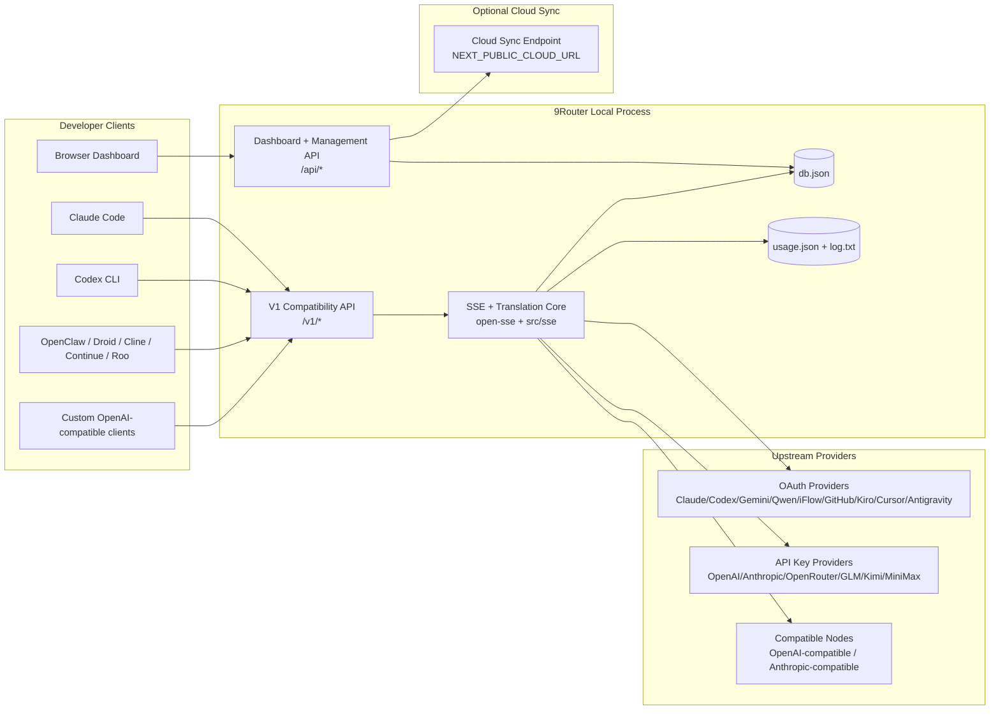
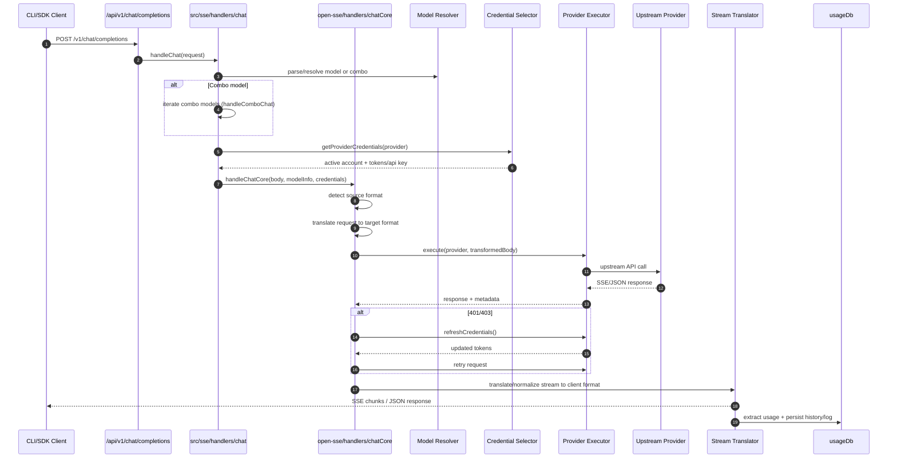
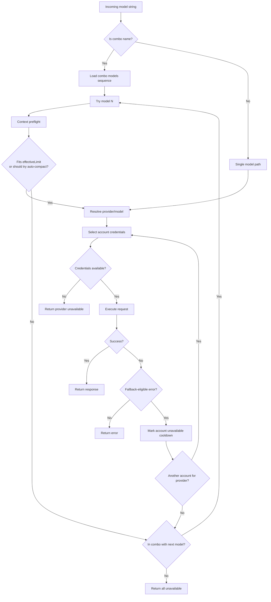
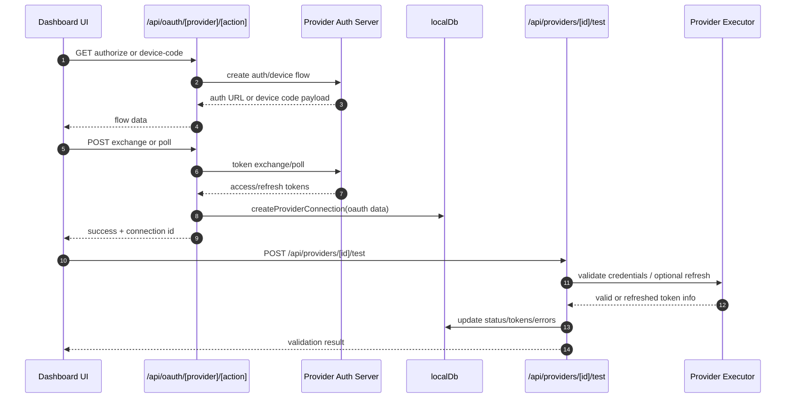
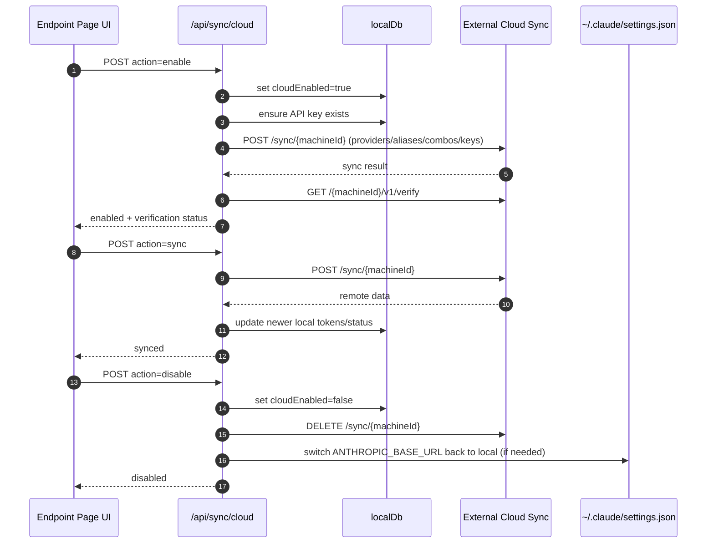
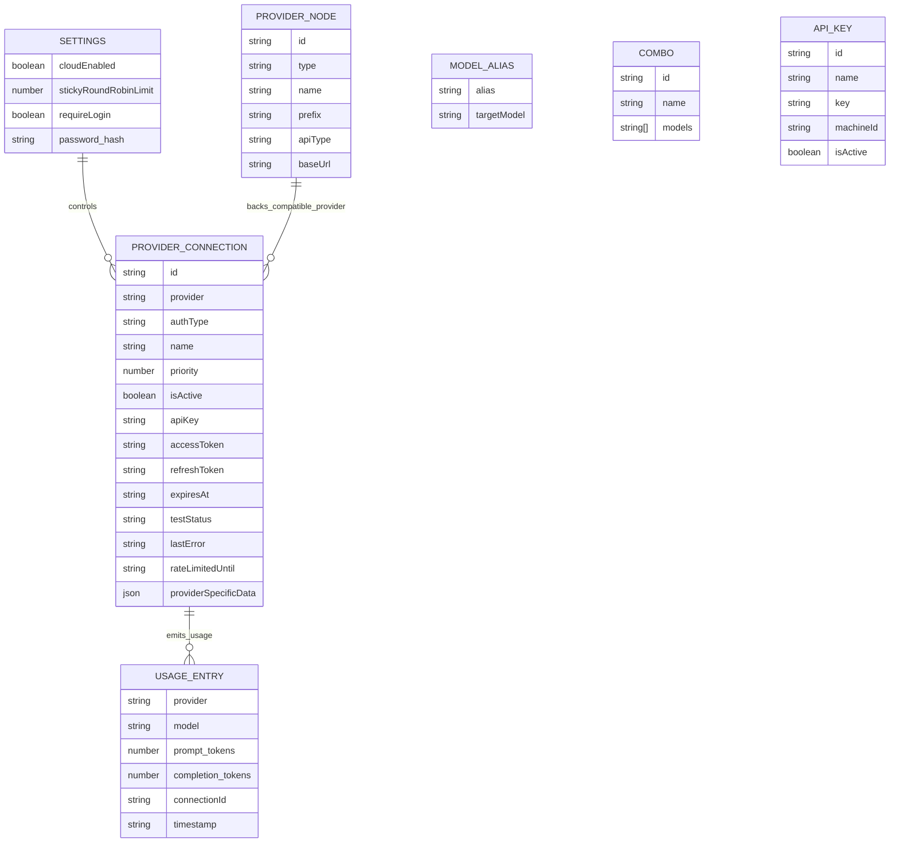
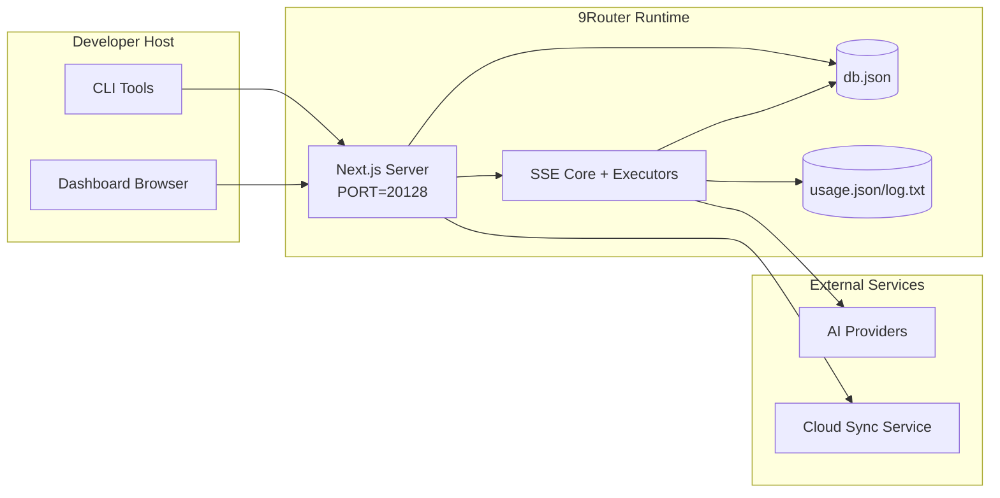

# Kiến trúc 9Router

_Cập nhật lần cuối: 2026-06-12_

## Tóm tắt điều hành (Executive Summary)

9Router là một cổng định tuyến AI cục bộ (local AI routing gateway) và dashboard được xây dựng trên Next.js.
Hệ thống cung cấp một endpoint tương thích OpenAI (OpenAI-compatible endpoint) duy nhất (`/v1/*`) và định tuyến traffic qua nhiều upstream provider với khả năng dịch định dạng (translation), fallback, làm mới token (token refresh), và theo dõi usage.

Năng lực cốt lõi:

- Bề mặt API tương thích OpenAI cho CLI/tools
- Dịch request/response giữa các định dạng provider
- Fallback theo combo model (chuỗi nhiều model)
- Fallback cấp account (nhiều account cho mỗi provider)
- Quản lý kết nối provider bằng OAuth và API key
- Lưu trữ cục bộ cho providers, keys, aliases, combos, settings, pricing
- Theo dõi usage/cost và ghi log request
- Cloud sync tùy chọn cho đồng bộ đa thiết bị/trạng thái

Mô hình runtime chính:

- Next.js app routes dưới `src/app/api/*` triển khai cả dashboard APIs và compatibility APIs
- SSE/routing core dùng chung trong `src/sse/*` + `open-sse/*` xử lý provider execution, translation, streaming, fallback, và usage

## Phạm vi và ranh giới (Scope and Boundaries)

### Trong phạm vi (In Scope)

- Local gateway runtime
- Dashboard management APIs
- Provider authentication và token refresh
- Request translation và SSE streaming
- Local state + usage persistence
- Điều phối cloud sync tùy chọn

### Ngoài phạm vi (Out of Scope)

- Triển khai cloud service phía sau `NEXT_PUBLIC_CLOUD_URL`
- Provider SLA/control plane bên ngoài local process
- Bản thân các external CLI binaries như Claude CLI, Codex CLI, v.v.

## Bối cảnh hệ thống cấp cao (High-Level System Context)



## Thành phần runtime cốt lõi (Core Runtime Components)

## 1) Lớp API và định tuyến (API and Routing Layer - Next.js App Routes)

Thư mục chính:

- `src/app/api/v1/*` và `src/app/api/v1beta/*` cho compatibility APIs
- `src/app/api/*` cho management/configuration APIs
- Next rewrites trong `next.config.mjs` map `/v1/*` sang `/api/v1/*`

Các compatibility routes quan trọng:

- `src/app/api/v1/chat/completions/route.js`
- `src/app/api/v1/messages/route.js`
- `src/app/api/v1/responses/route.js`
- `src/app/api/v1/models/route.js`
- `src/app/api/v1/messages/count_tokens/route.js`
- `src/app/api/v1beta/models/route.js`
- `src/app/api/v1beta/models/[...path]/route.js`

Các domain quản lý:

- Auth/settings: `src/app/api/auth/*`, `src/app/api/settings/*`
- Providers/connections: `src/app/api/providers*`
- Provider nodes: `src/app/api/provider-nodes*`
- OAuth: `src/app/api/oauth/*`
- Keys/aliases/combos/pricing: `src/app/api/keys*`, `src/app/api/models/alias`, `src/app/api/combos*`, `src/app/api/pricing`
- Usage: `src/app/api/usage/*`
- Sync/cloud: `src/app/api/sync/*`, `src/app/api/cloud/*`
- CLI tooling helpers: `src/app/api/cli-tools/*`

## 2) SSE + Translation Core

Các module luồng chính:

- Entry: `src/sse/handlers/chat.js`
- Điều phối core: `open-sse/handlers/chatCore.js`
- Provider execution adapters: `open-sse/executors/*`
- Format detection/provider config: `open-sse/services/provider.js`
- Model parse/resolve: `src/sse/services/model.js`, `open-sse/services/model.js`
- Combo fallback logic: `open-sse/services/combo.js`
- Account fallback logic: `open-sse/services/accountFallback.js`
- Provider input-limit / Kiro auto-compact helper: `open-sse/utils/autoCompact.js`
- Translation registry: `open-sse/translator/index.js`
- Stream transformations: `open-sse/utils/stream.js`, `open-sse/utils/streamHandler.js`
- Usage extraction/normalization: `open-sse/utils/usageTracking.js`

## 3) Lớp lưu trữ (Persistence Layer)

Primary state DB:

- `src/lib/localDb.js`
- file: `${DATA_DIR}/db.json` hoặc `~/.9router/db.json` khi chưa set `DATA_DIR`
- entities: providerConnections, providerNodes, modelAliases, combos, apiKeys, settings, pricing

Usage DB:

- `src/lib/usageDb.js`
- files: `~/.9router/usage.json`, `~/.9router/log.txt`
- ghi chú: hiện độc lập với `DATA_DIR`

## 4) Auth + Security Surfaces

- Dashboard cookie auth: `src/proxy.js`, `src/app/api/auth/login/route.js`
- API key generation/verification: `src/shared/utils/apiKey.js`
- Provider secrets được lưu trong các entry `providerConnections`
- Hỗ trợ proxy tùy chọn cho upstream calls qua env proxy variables (`open-sse/utils/proxyFetch.js`)

## 5) Cloud Sync

- Scheduler init: `src/lib/initCloudSync.js`, `src/shared/services/initializeCloudSync.js`
- Periodic task: `src/shared/services/cloudSyncScheduler.js`
- Control route: `src/app/api/sync/cloud/route.js`

## Vòng đời request (`/v1/chat/completions`)



## Luồng Combo + Account Fallback



Các quyết định fallback cấp account được điều khiển bởi `open-sse/services/accountFallback.js`, dựa trên status codes và error-message heuristics. Fallback cấp combo nằm ở `open-sse/services/combo.js` và chạy trước khi dispatch từng model.

### Context-aware combo fallback

Combo fallback không được dùng `contextWindow` quảng cáo của model làm giới hạn duy nhất. Router phải tính giới hạn hiệu dụng (effective limit) cho từng combo member:

```text
effectiveLimit = min(model contextWindow, provider inputLimit) nếu cả hai đều biết
effectiveLimit = provider inputLimit hoặc model contextWindow nếu chỉ biết một giá trị
```

Ví dụ: `kr/claude-opus-4.8` có metadata `contextWindow=1_000_000`, nhưng Kiro có provider input limit mặc định `150_000`, nên effective limit của request qua Kiro là `150_000`, không phải `1M`.

Preflight của `handleComboChat` ước lượng:

- `estimatedTokens`: input payload estimate, có safety ratio
- `requiredTokens`: `estimatedTokens + max(defaultReserve, requestedMaxTokens)`
- `effectiveLimit`: context limit thực tế của combo member

Rule chọn fallback:

- Nếu model hiện tại fit `effectiveLimit`, gọi model đó bình thường.
- Nếu model hiện tại không fit và có combo member phía sau với `effectiveLimit` lớn hơn và đủ chứa `requiredTokens`, skip model hiện tại để route sang fallback lớn hơn.
- Nếu model hiện tại có provider `inputLimit` nhưng không có fallback lớn hơn đủ fit, vẫn gọi model hiện tại để provider-specific auto-compact có cơ hội giảm payload. Trường hợp chính hiện nay là Kiro.
- Nếu model không có provider `inputLimit` và không fit context, không gọi upstream; trả context error hoặc tiếp tục sang combo member đủ điều kiện.
- Khi upstream trả context-window error sau dispatch, combo chỉ fallback sang model phía sau có `effectiveLimit` lớn hơn. Không fallback sang model cùng hoặc nhỏ hơn context tier.

Hệ quả vận hành:

- Combo dùng cho session dài nên gom các model cùng effective context tier, hoặc phải có fallback lớn hơn thật sự ở phía sau.
- Không trộn Kiro `150k effective` với model `1M` theo kiểu tuần tự nếu không muốn Kiro bị skip trên session dài; nếu trộn, router sẽ chỉ gọi Kiro khi request fit hoặc khi fallback lớn hơn cũng không fit và auto-compact là đường cứu còn lại.
- Combo tên theo model mạnh, ví dụ `opus-4.8`, không nên chứa fallback âm thầm xuống lower-quality tier như `claude-opus-4.6`, trừ khi đó là chủ ý sản phẩm rõ ràng.

## Vòng đời OAuth Onboarding và Token Refresh



Refresh trong live traffic được thực thi bên trong `open-sse/handlers/chatCore.js` qua executor `refreshCredentials()`.

## Vòng đời Cloud Sync (Enable / Sync / Disable)



Periodic sync được kích hoạt bởi `CloudSyncScheduler` khi cloud được bật.

## Data Model và Storage Map



Các file lưu trữ vật lý:

- main state: `${DATA_DIR}/db.json` hoặc `~/.9router/db.json`
- usage stats: `~/.9router/usage.json`
- request log lines: `~/.9router/log.txt`
- translator/request debug sessions tùy chọn: `<repo>/logs/...`

## Deployment Topology



## Module Mapping quan trọng cho quyết định (Decision-Critical)

### Route và API Modules

- `src/app/api/v1/*`, `src/app/api/v1beta/*`: compatibility APIs
- `src/app/api/providers*`: provider CRUD, validation, testing
- `src/app/api/provider-nodes*`: quản lý custom compatible node
- `src/app/api/oauth/*`: OAuth/device-code flows
- `src/app/api/keys*`: local API key lifecycle
- `src/app/api/models/alias`: alias management
- `src/app/api/combos*`: fallback combo management
- `src/app/api/pricing`: pricing overrides cho cost calculation
- `src/app/api/usage/*`: usage và logs APIs
- `src/app/api/sync/*` + `src/app/api/cloud/*`: cloud sync và cloud-facing helpers
- `src/app/api/cli-tools/*`: local CLI config writers/checkers

### Routing và Execution Core

- `src/sse/handlers/chat.js`: request parse, combo handling, account selection loop
- `open-sse/handlers/chatCore.js`: translation, executor dispatch, retry/refresh handling, stream setup
- `open-sse/executors/*`: network behavior và format behavior riêng theo provider

### Translation Registry và Format Converters

- `open-sse/translator/index.js`: translator registry và orchestration
- Request translators: `open-sse/translator/request/*`
- Response translators: `open-sse/translator/response/*`
- Format constants: `open-sse/translator/formats.js`

### Persistence

- `src/lib/localDb.js`: persistent config/state
- `src/lib/usageDb.js`: usage history và rolling request logs

## Phạm vi Provider Executor Coverage

Specialized executors:

- `antigravity`
- `gemini-cli`
- `github`
- `kiro`
- `codex`
- `cursor`

Default executor path:

- Tất cả provider khác, bao gồm compatible node providers, dùng `open-sse/executors/default.js`

## Phạm vi Format Translation Coverage

Detected source formats gồm:

- `openai`
- `openai-responses`
- `claude`
- `gemini`

Target formats gồm:

- OpenAI chat/Responses
- Claude
- Gemini/Gemini-CLI/Antigravity envelope
- Kiro
- Cursor

Translation được chọn động dựa trên source payload shape và provider target format.

## Failure Modes và Resilience

## 1) Account/Provider Availability

- provider account cooldown trên transient/rate/auth errors
- account fallback trước khi request thất bại
- combo model fallback khi current model/provider path đã cạn lựa chọn

## 2) Token Expiry

- pre-check và refresh kèm retry cho refreshable providers
- retry sau refresh attempt cho lỗi 401/403 trong core path

## 3) Stream Safety

- disconnect-aware stream controller
- translation stream có end-of-stream flush và xử lý `[DONE]`
- fallback ước lượng usage khi provider usage metadata bị thiếu

## 4) Cloud Sync Degradation

- sync errors được surface nhưng local runtime vẫn tiếp tục
- scheduler có retry-capable logic, nhưng periodic execution hiện mặc định gọi single-attempt sync

## 5) Data Integrity

- DB shape migration/repair cho missing keys
- corrupt JSON reset safeguards cho localDb và usageDb

## Observability và Operational Signals

Nguồn runtime visibility:

- console logs từ `src/sse/utils/logger.js`
- per-request usage aggregates trong `usage.json`
- textual request status log trong `log.txt`
- optional deep request/translation logs dưới `logs/` khi `ENABLE_REQUEST_LOGS=true`
- dashboard usage endpoints (`/api/usage/*`) cho UI consumption

## Security-Sensitive Boundaries

- JWT secret (`JWT_SECRET`) bảo vệ dashboard session cookie verification/signing
- Initial password fallback (`INITIAL_PASSWORD`, mặc định `123456`) phải được override trong real deployments
- API key HMAC secret (`API_KEY_SECRET`) bảo vệ generated local API key format
- Provider secrets (API keys/tokens) được persist trong local DB và cần được bảo vệ ở filesystem level
- Cloud sync endpoints dựa vào API key auth + machine id semantics

## Environment và Runtime Matrix

Environment variables đang được code sử dụng:

- App/auth: `JWT_SECRET`, `INITIAL_PASSWORD`
- Storage: `DATA_DIR`
- Security hashing: `API_KEY_SECRET`, `MACHINE_ID_SALT`
- Logging: `ENABLE_REQUEST_LOGS`
- Sync/cloud URLing: `NEXT_PUBLIC_BASE_URL`, `NEXT_PUBLIC_CLOUD_URL`
- Outbound proxy: `HTTP_PROXY`, `HTTPS_PROXY`, `ALL_PROXY`, `NO_PROXY` và các biến lowercase tương ứng
- Platform/runtime helpers, không phải app-specific config: `APPDATA`, `NODE_ENV`, `PORT`, `HOSTNAME`

## Ghi chú kiến trúc đã biết (Known Architectural Notes)

1. `usageDb` hiện lưu dưới `~/.9router` và không đi theo `DATA_DIR`.
2. `/api/v1/route.js` trả về static model list và không phải nguồn models chính được `/v1/models` sử dụng.
3. Request logger ghi full headers/body khi bật; cần xem log directory là dữ liệu nhạy cảm.
4. Cloud behavior phụ thuộc vào `NEXT_PUBLIC_BASE_URL` chính xác và cloud endpoint có thể truy cập được.

## Checklist xác minh vận hành (Operational Verification Checklist)

- Build from source: `cd /root/dev/9router && npm run build`
- Build Docker image: `cd /root/dev/9router && docker build -t 9router .`
- Start service và verify:
- `GET /api/settings`
- `GET /api/v1/models`
- CLI target base URL nên là `http://<host>:20128/v1` khi `PORT=20128`
