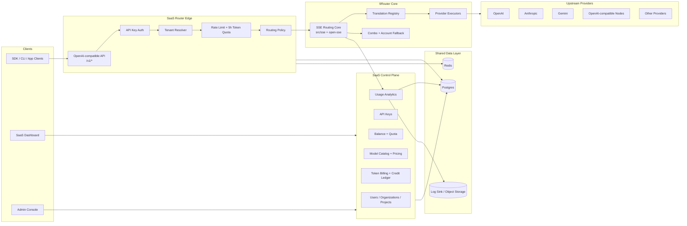
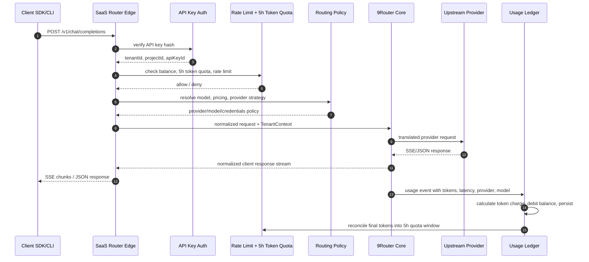
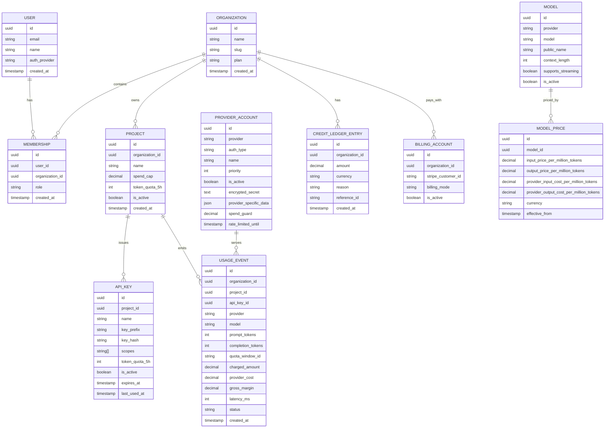

# Kiến trúc SaaS cho 9Router

_Trạng thái: bản định hướng ban đầu_
_Mục tiêu: nâng cấp 9Router thành SaaS kiểu OpenRouter nhưng vẫn giữ 9Router core dễ cập nhật từ upstream open-source._

## Tóm tắt

Hướng nâng cấp an toàn nhất là giữ 9Router làm routing core và thêm SaaS layer bao quanh. 9Router core tiếp tục xử lý request/response translation, SSE streaming, provider execution, fallback, token refresh, model combo, và provider adapter. SaaS layer chịu trách nhiệm cho multi-tenancy, platform API key auth, prepaid balance/quota, token-based charging, usage ledger, dashboard cloud, và quản trị Provider Pool thuộc platform.

Nguyên tắc chính:

- Không rewrite 9Router core thành SaaS ngay từ đầu.
- Không trộn billing, tenant, quota logic sâu vào `open-sse/*` hoặc `src/sse/*`.
- Tạo adapter/interface ở boundary để core vẫn chạy được ở local mode và SaaS mode.
- Các patch vào core phải nhỏ, rõ lý do, và có khả năng upstream PR hoặc merge lại từ upstream.

## Target Architecture



## Boundary giữa 9Router Core và SaaS Layer

### 9Router Core giữ trách nhiệm

- Nhận normalized request từ router edge.
- Dịch format giữa OpenAI, Claude, Gemini, OpenAI Responses, và provider-specific formats.
- Chọn executor phù hợp theo provider/model.
- Xử lý SSE streaming và non-streaming response.
- Refresh token khi provider hỗ trợ.
- Account fallback và combo model fallback.
- Trả về response hoặc normalized error cho caller.

Các khu vực nên giữ upstream-friendly:

- `open-sse/handlers/chatCore.js`
- `open-sse/executors/*`
- `open-sse/translator/*`
- `open-sse/services/*`
- `src/sse/handlers/chat.js`
- `src/sse/services/model.js`

### SaaS Layer giữ trách nhiệm

- User, organization, project, membership, role-based access control (RBAC).
- Platform API key generation, hashing, rotation, revoke.
- Tenant/project resolution từ API key.
- Rate limit, prepaid balance/quota check, Five-Hour Token Quota, spend guard, abuse protection.
- Usage ledger chính xác cho token billing.
- Pricing theo input/output tokens, invoice, prepaid credit, Stripe integration.
- Provider Pool management cho platform-owned provider accounts.
- Dashboard cloud cho tenant và admin.
- Audit logs, compliance controls, operational analytics.
- Không expose provider account management cho user.

### Boundary interfaces đề xuất

Các interface này giúp core chạy được cả local mode và SaaS mode:

```ts
interface TenantContext {
  tenantId: string;
  projectId: string;
  apiKeyId: string;
  billingMode: "prepaid";
}

interface CredentialProvider {
  getCredentials(input: {
    tenant: TenantContext;
    provider: string;
    model: string;
  }): Promise<ProviderCredentials[]>;
}

interface BalanceChecker {
  checkAndReserve(input: {
    tenantId: string;
    projectId: string;
    apiKeyId: string;
    model: string;
    estimatedInputTokens: number;
    estimatedOutputTokens: number;
  }): Promise<BalanceDecision>;
}

interface TokenQuotaChecker {
  checkAndReserve(input: {
    tenantId: string;
    projectId: string;
    apiKeyId: string;
    model: string;
    estimatedTokens: number;
    windowHours: 5;
  }): Promise<TokenQuotaDecision>;

  reconcile(input: {
    reservationId: string;
    finalInputTokens: number;
    finalOutputTokens: number;
  }): Promise<void>;
}

interface UsageReporter {
  recordUsage(event: UsageEvent): Promise<void>;
}

interface PricingResolver {
  resolvePrice(input: {
    provider: string;
    model: string;
    tenantId?: string;
  }): Promise<ModelPrice>;
}

interface RateLimitChecker {
  checkAndConsume(input: {
    tenantId: string;
    projectId: string;
    apiKeyId: string;
    model: string;
  }): Promise<RateLimitDecision>;
}
```

Local mode sẽ dùng `LocalFileCredentialProvider`, `LocalUsageReporter`, `LocalPricingResolver`. SaaS mode sẽ dùng `PlatformCredentialProvider`, `LedgerUsageReporter`, `SaaSPricingResolver`, và `BalanceChecker`. `PlatformCredentialProvider` chỉ đọc provider credentials từ Provider Pool do admin/platform quản lý, không đọc credentials từ user/project.

Five-Hour Token Quota nên dùng Redis atomic counters cho preflight reservation và được reconcile bằng final usage từ Usage Ledger.

## Request Lifecycle

### Public `/v1/chat/completions`



### Failure handling

- Nếu API key invalid: edge trả `401` trước khi gọi core.
- Nếu balance/quota không đủ: edge trả `402` hoặc `429` theo policy.
- Nếu Five-Hour Token Quota vượt giới hạn: edge trả `429` trước provider call.
- Nếu provider account lỗi tạm thời: core xử lý account fallback.
- Nếu combo model còn lựa chọn khác: core xử lý combo fallback.
- Nếu tất cả provider path đều lỗi: edge ghi usage/error event và trả normalized error.

## Data Model



## Storage Strategy

- Postgres: source of truth cho tenant, project, platform API keys, Provider Pool admin config, model catalog, pricing, usage ledger, credit ledger, billing state.
- Redis: rate limit counters, Five-Hour Token Quota counters/reservations, quota cache, provider health, account cooldown, short-lived request state.
- Object Storage hoặc log sink: request logs, audit logs, debug traces nếu bật.
- Local file storage vẫn được giữ cho local mode để không phá experience hiện tại của 9Router.

## Provider Model

### Platform-Owned Provider Pool

Platform giữ provider credentials và bán lại access theo prepaid balance/quota. User không được thêm provider credentials, không được chọn provider account riêng, và không thấy secret/provider account internals.

Ưu điểm:

- Trải nghiệm giống OpenRouter hơn.
- User chỉ cần một API key platform.
- Có thể tối ưu routing theo cost/latency/quality.

Nhược điểm:

- Cần billing chính xác theo input/output tokens.
- Platform chịu rủi ro abuse và provider cost.
- Cần provider operations và account health management.

## Compatibility với upstream 9Router

Để merge upstream thường xuyên:

- Giữ SaaS-specific code trong thư mục riêng như `saas/*` hoặc package riêng.
- Không đổi public behavior của local `/v1/*` nếu không cần.
- Tách core abstractions thành adapter nhỏ, có default local implementation.
- Viết tests cho boundary adapters để phát hiện upstream breakage sớm.
- Dùng branch strategy:
  - `upstream/main`: mirror từ open-source 9Router.
  - `main`: bản SaaS.
  - `saas/*`: feature branches cho SaaS layer.

## Non-Goals ban đầu

- Chưa làm full marketplace ở phase đầu.
- Chưa thay toàn bộ `localDb.js` bằng Postgres ngay.
- Chưa rewrite dashboard hiện tại thành enterprise admin portal.
- Chưa tự động optimize provider routing bằng machine learning.
- Chưa cho user add provider account/BYOK.
- Chưa expose provider account internals cho user.
